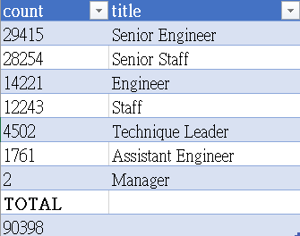

# Pewlett-Hackard-Analysis
## Overview:
A large number of people are expected to retire in the upcoming years. As a result, company is planning to come up with a mentorship program called "silver tsunami" to fill the future opening positions to smooth out the transition of this retirement wave.
Our task is to perform employee research and determine the number of retiring employees per title, and identify employees who are eligible to participate in a mentorship program.

## Result:
1. There are 90398 employees in total who are reaching the retirement age. 
2. There will be 29415 senior engineer position, 28254 senior staff position, 14221 engineer position, 12243 staff position, 4502 technique leader, 1761 assistant engineer and 2 manager position available.
3. The breakdown of retiring employees by title is as below:
 

  4. There are 1549 employees who will be eligible for the mentorship program.

## Summary
1. How many roles will need to be filled as the "silver tsunami" begins to make an impact?
2. Are there enough qualified, retirement-ready employees in the departments to mentor the next generation of Pewlett Hackard employees?
